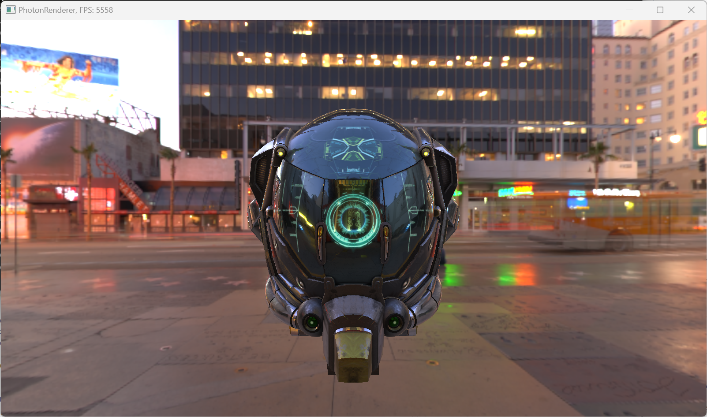
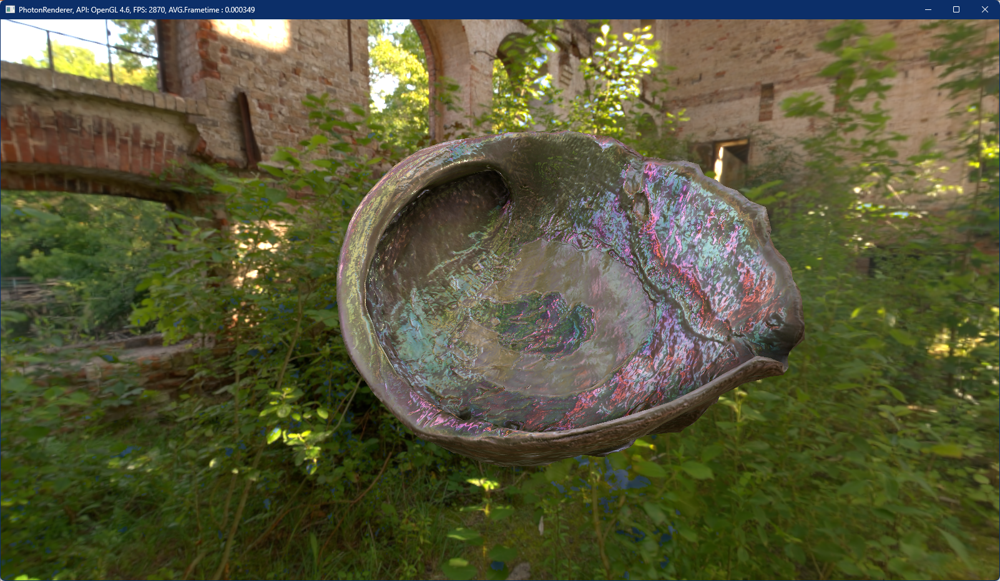
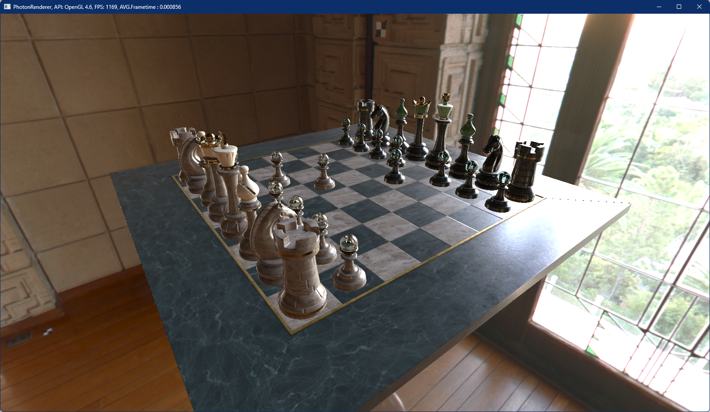
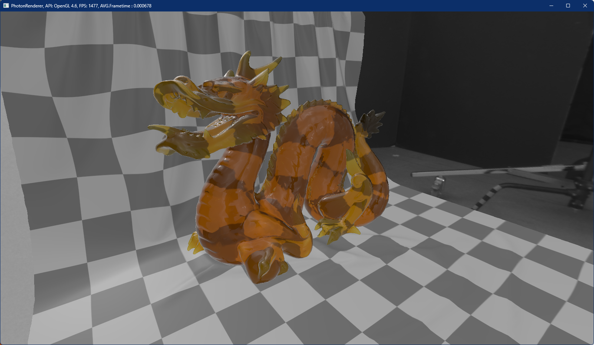
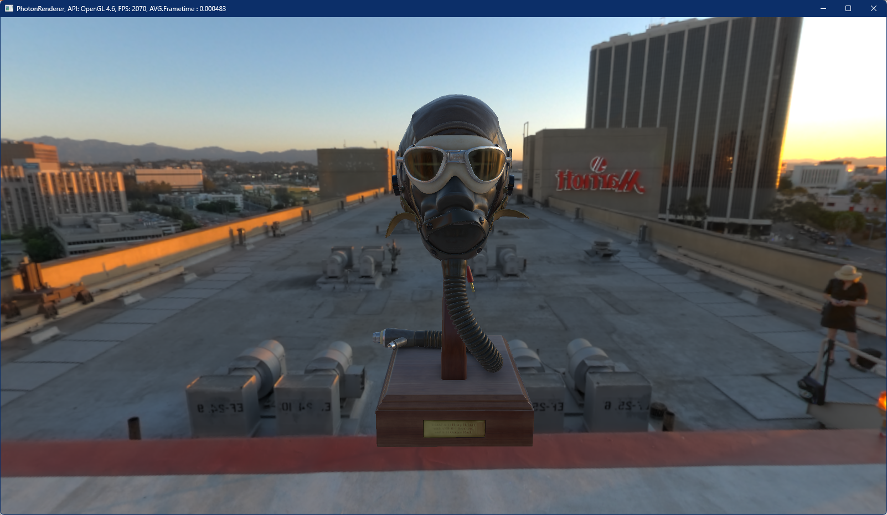
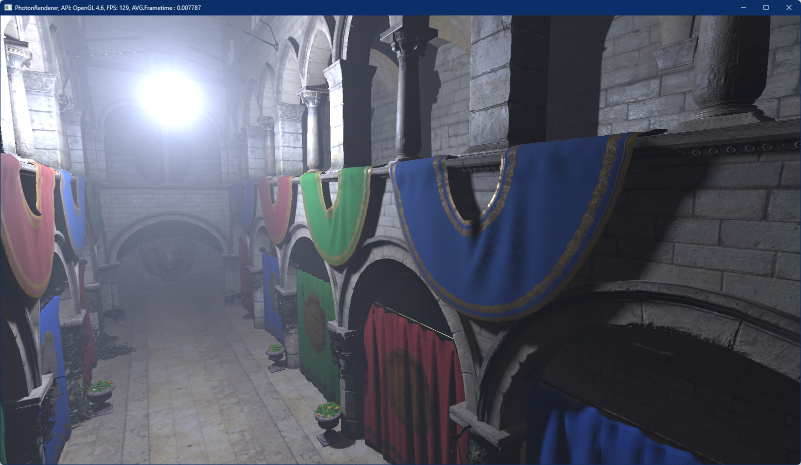
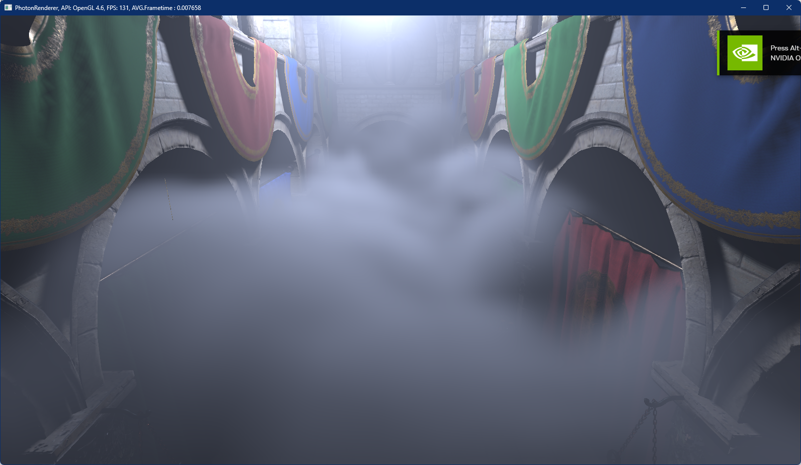
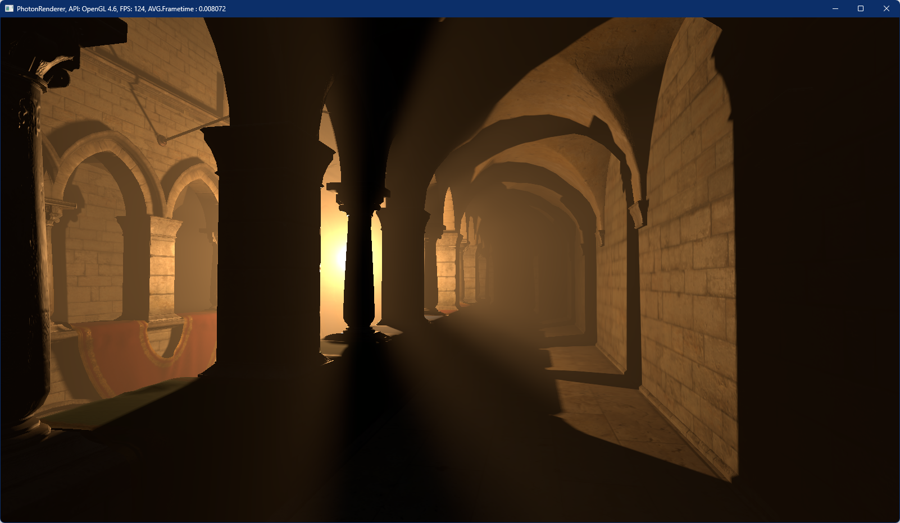
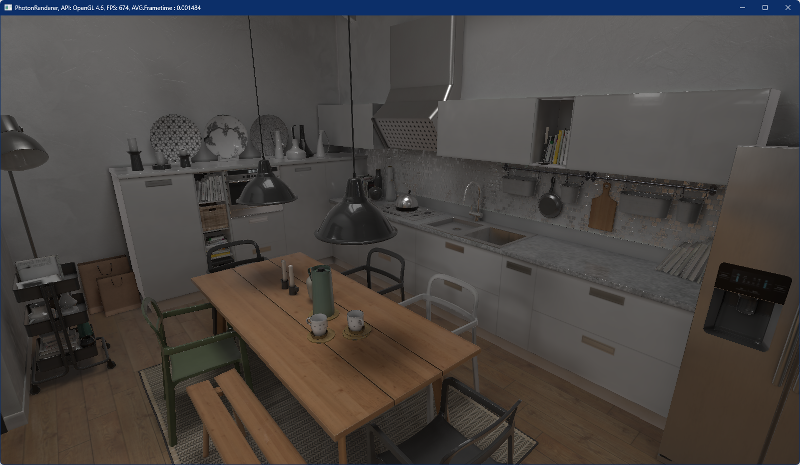

# PhotonRenderer
This is a real-time rendering engine for coherent mixed reality. It works on Windows, Linux and Android based platforms with rendering backends for OpenGL, OpenGL ES, Direct3D 11 and Vulkan.

## Dependencies

### Required
- glm: vector and matrix math
- stb-image: image file import (png, jpg, hdr)
- OpenGL: GL registry for loading GL functions
- rapidjson: JSON support for importing glTF files

### Optional
- assimp: import over 40 3D file formats
- imgui: UI support with rendering backends
- imguizmo: 3D Gizmos
- ktx: import KTX Texture files
- libwebp: import WebP image files
- ryml: YAML support for importing Unity scenes
- tiff: import TIFF image files
- tinyexr: import EXR image files
- vulkan: support for vulkan backend

## Installation
Installation was tested on Win10 x64 with Visual Studio 2017 and 2019. It's recommended to use VCPKG for installation.

Requirenments: 
- CMake
- Git
- Visual Studio 2017 or 2019

### Build dependencies
Download and install [VCPKG](https://github.com/microsoft/vcpkg). Set environment variable VCPKG_DEFAULT_TRIPLET=x64-windows.

Install dependencies:
Minimal install
```
./vcpkg.exe install glm stb opengl rapidjson
```

Full install
```
./vcpkg install assimp glm imgui[win32-binding,docking-experimental] imguizmo ktx libwebp ryml stb tiff tinyexr vulkan
```

### Building
Open CMake-GUI
- set source path to ./PhotonRenderer/
- set build path to ./PhotonRenderer/build
- press configure and select your visual studio version and the platform x64
- select specify toolchain file for cross-compiling
- set toolchain file to: <vcpkg_root>/scripts/buildsystems/vcpkg.cmake
- press generate and open solution
- select configuration Release x64 and Build Solution

## Running
Download sample [assets](https://files.icg.tugraz.at/f/60a18ad065a146e8a997/) and extract in the root folder. Run the solution and you should see something like this.

 

## Features
### Rendering
- Tiled Forward+ and Deferred rendering paths
- Default PBR Material (Metal and Dielectric BRDFs)
- Many material extension like Sheen/Clearcoad and Transmission
- HDR/IBL lighting
- Postprocessing including Bloom, DoF and Tone mapping
- PCF shadows
- SSAO
- Screen-space refractions
- Local fog volumes
### Backends
- OpenGL 4.0+ for Linux and Windows
- OpenGL ES 3.0+ for Android
- Vulkan 1.0 for Android, Linux and Windows
- Direct3D 11 for Windows
### File Formats
- Full support of glTF 2.0 including most extensions
- Support for other file formats via Assimp
- Many image formats including PNG, JPG, EXR, TIFF, ...
  
## Examples
### PBR Materials
 

 


### Volumetric Fog & Shadows




### Complex Scenes (imported from Unity)




